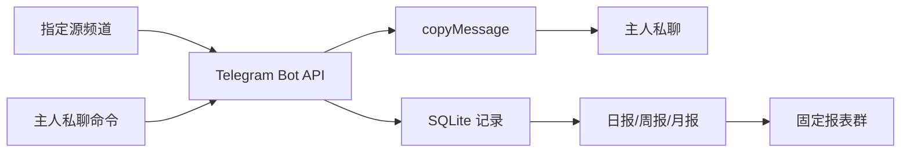

<div align="center">

# SlowLink Assistant Bot

**Telegram 频道消息复制、私聊通知与定时报表 Bot**

[](https://github.com/suzijin876-lgtm/slowlink-assistant-bot/releases/latest)
[](https://github.com/suzijin876-lgtm/slowlink-assistant-bot/actions/workflows/release.yml)
[](https://www.python.org/)
[](https://www.docker.com/)
[](LICENSE)

[快速安装](#快速安装) · [主要功能](#主要功能) · [日常管理](#日常管理) · [更新日志](CHANGELOG.md) · [版本发布](https://github.com/suzijin876-lgtm/slowlink-assistant-bot/releases)

</div>

SlowLink Assistant Bot 与主 [SlowLink](https://github.com/suzijin876-lgtm/slowlink) 分开运行。它不负责内容识别、规则匹配或去重，只负责频道消息复制、主人私聊通知，以及向固定群组发送日报、周报和月报。

## 快速安装

支持 Ubuntu、Debian，需要 `root` 或 `sudo` 权限：

```bash
curl -fsSL https://raw.githubusercontent.com/suzijin876-lgtm/slowlink-assistant-bot/main/install.sh | sudo bash
```

脚本会显示中文菜单，可选择安装、更新、卸载或修改配置。修改配置时每项直接回车即可保留原值，失败会自动恢复旧配置。首次安装需要填写 Bot Token、主人用户 ID、固定报表群和源频道。

## 主要功能

| 功能 | 说明 |
| --- | --- |
| 频道帖子链接 | 只复制整条内容为`t.me/频道/消息号`的帖子；纯文本、附加文字和置顶通知直接跳过 |
| 私聊通知 | 向主人发送转发结果、运行提醒和自检信息 |
| 定时报表 | 每日、每周和每月自动向固定群组发送转发统计 |
| 权限限制 | 私聊和群组命令仅允许配置的主人使用，非授权群组可自动退出 |
| SQLite 记录 | 保存更新偏移、转发结果、报表状态和必要统计 |
| 稳定运行 | Docker 自动重启、健康检查、数据库备份和独立 CPU watchdog |

## 工作流程



## 日常管理

默认安装目录为 `/opt/slowlink_assistant_bot`。

| 命令 | 用途 |
| --- | --- |
| `sudo /opt/slowlink_assistant_bot/manage.sh status` | 查看版本、容器和 watchdog 状态 |
| `sudo /opt/slowlink_assistant_bot/manage.sh logs` | 查看 Bot 实时日志 |
| `sudo /opt/slowlink_assistant_bot/manage.sh restart` | 只重启 Assistant Bot |
| `sudo /opt/slowlink_assistant_bot/manage.sh update` | 更新到最新正式版本 |
| `sudo /opt/slowlink_assistant_bot/manage.sh backup` | 手动备份 SQLite 数据库 |
| `sudo /opt/slowlink_assistant_bot/manage.sh uninstall` | 卸载程序并保留配置和数据库 |
| `sudo /opt/slowlink_assistant_bot/manage.sh purge` | 二次确认后彻底删除 |

## Bot 命令

| 命令 | 用途 |
| --- | --- |
| `/status` | 查看运行状态 |
| `/report` | 查看当前报告 |
| `/recent` | 查看最近转发记录 |
| `/check` | 检查 Telegram、数据库和 watchdog |
| `/help` | 查看可用命令 |

固定报表群内仅保留主人可用的 `/report`。

## 版本发布

推送 `v*` 标签后，GitHub Actions 会运行 Python 编译、单元测试和 Shell 语法检查，并在线发布三个资产：

| 资产 | 用途 |
| --- | --- |
| `slowlink_assistant_bot_app_v*.zip` | Bot 应用代码包 |
| `slowlink_assistant_bot_v*_full.zip` | 完整安装包 |
| `SHA256SUMS.txt` | 两个 ZIP 的 SHA-256 校验 |

本地版本归档还会保留 `update_log.txt`；该文件用于生成 Release 中文正文，不作为线上资产上传。

## 安全说明

仓库和 Release 不包含 `.env`、Token、密码、Session、SQLite、日志、备份或其他运行数据。

## License

[MIT License](LICENSE)
